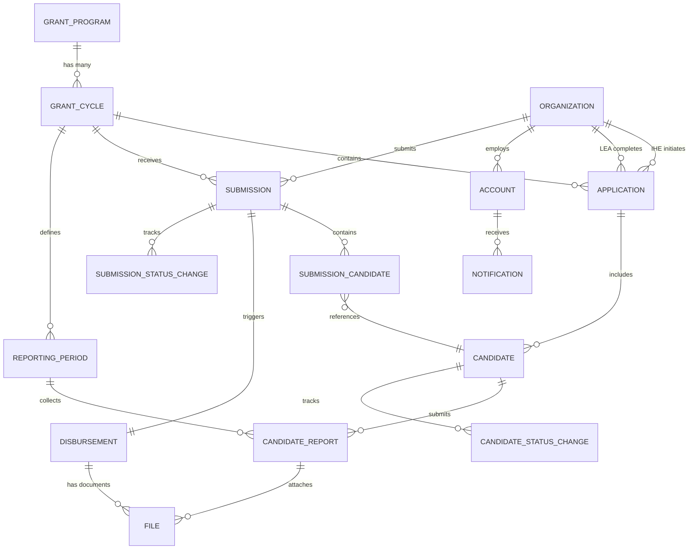
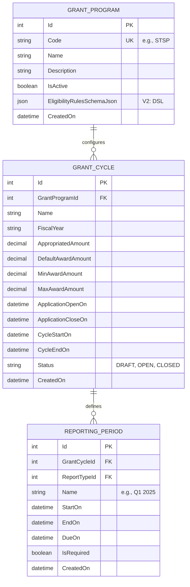
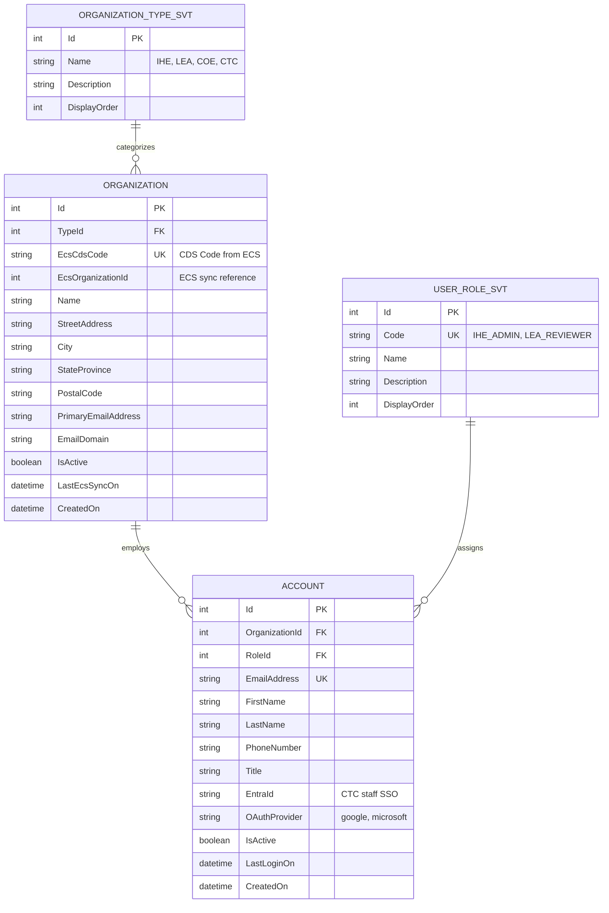
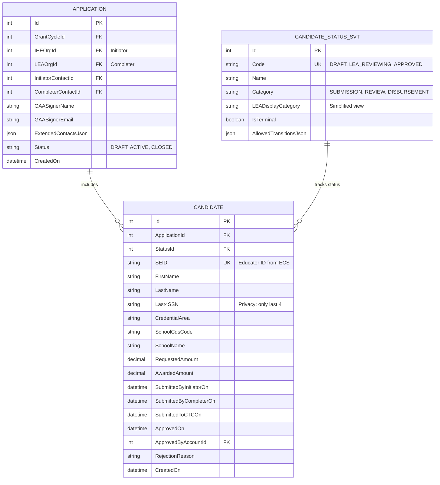
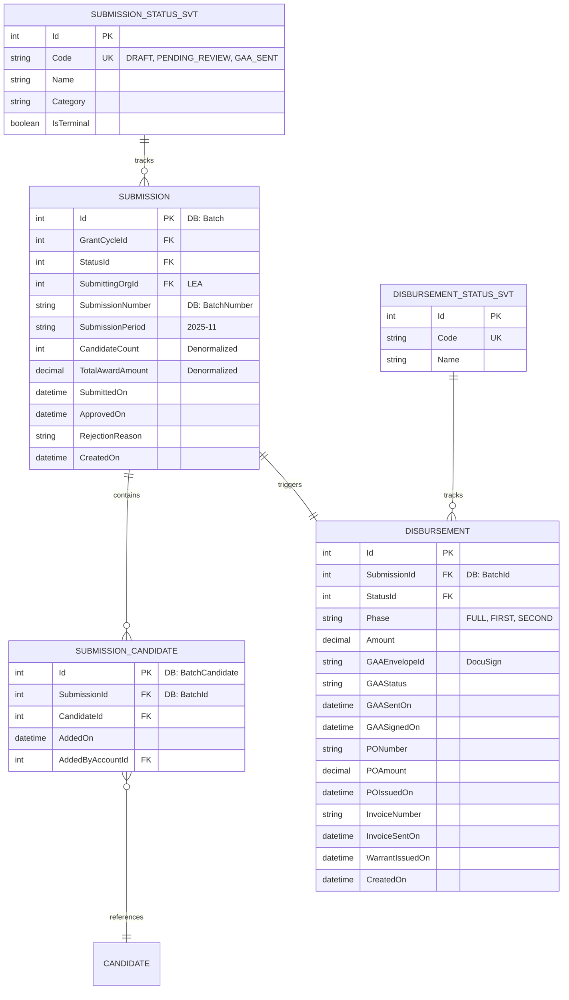
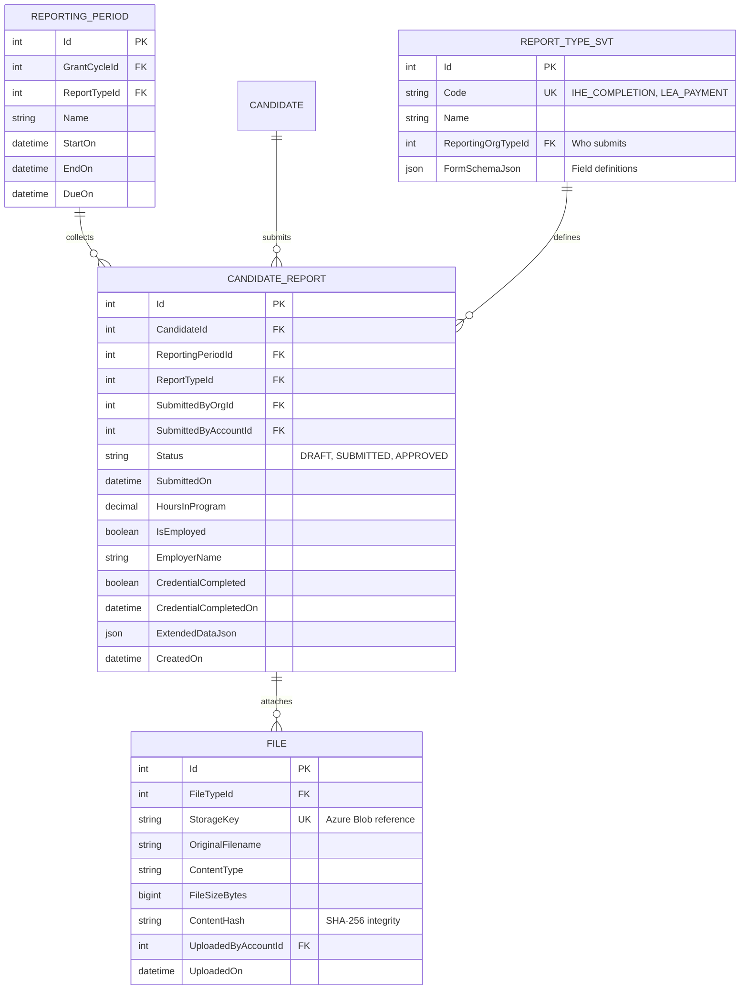

# GMS Data Architecture - Supplementary Analysis

**California Commission on Teacher Credentialing**
**Grant Management System - Data Architecture Supplement**
**December 2025**
**Author: Noah Gallego**

---

## Purpose

This document provides supplementary data architecture analysis to complement the primary GMS V1 Schema (`GMS-V1-Schema.md`). It includes:

1. **ERD Visualization** - Mermaid diagrams using application UI terminology
2. **Data Flow Diagrams** - System data movement and external integrations
3. **Gap Analysis** - Differences between current app implementation and schema
4. **Integration Architecture** - ECS, DocuSign, and notification system design
5. **Security & Compliance** - R4 framework compliance summary
6. **Recommendations** - Proposed schema additions

> **Note:** This document is meant to be merged with the primary schema documentation. It does NOT duplicate the SQL DDL already defined in `GMS-V1-Schema.md`.

---

## Table of Contents

1. [ERD Visualization](#1-erd-visualization)
   - [High-Level System ERD](#11-high-level-system-erd)
   - [Core Configuration Domain](#12-core-configuration-domain)
   - [Organization & User Domain](#13-organization--user-domain)
   - [Application & Candidate Domain](#14-application--candidate-domain)
   - [Submission & Disbursement Domain](#15-submission--disbursement-domain)
   - [Reporting Domain](#16-reporting-domain)
2. [Data Flow Diagrams](#2-data-flow-diagrams)
   - [Candidate Submission Flow](#21-candidate-submission-flow)
   - [External System Integration Flow](#22-external-system-integration-flow)
   - [Reporting Data Flow](#23-reporting-data-flow)
   - [Disbursement Payment Flow](#24-disbursement-payment-flow)
3. [Gap Analysis](#3-gap-analysis)
   - [Missing Fields](#31-missing-fields)
   - [Terminology Mapping](#32-terminology-mapping)
   - [Missing Integration Tables](#33-missing-integration-tables)
4. [Integration Architecture](#4-integration-architecture)
   - [ECS Integration](#41-ecs-integration)
   - [DocuSign Integration](#42-docusign-integration)
   - [Notification System](#43-notification-system)
5. [Security & Compliance](#5-security--compliance)
6. [Recommendations](#6-recommendations)

---

## 1. ERD Visualization

### 1.1 High-Level System ERD

This diagram shows the complete GMS data model using UI terminology (where applicable).



---

### 1.2 Core Configuration Domain

Grant program and cycle configuration entities.



---

### 1.3 Organization & User Domain

Organizations (IHE/LEA) and user accounts.



---

### 1.4 Application & Candidate Domain

IHE-LEA partnerships and candidate records.



---

### 1.5 Submission & Disbursement Domain

Monthly submissions (batches) and payment processing.

> **Terminology Note:** The database uses `Batch` but the UI displays as "Submission" to users.



---

### 1.6 Reporting Domain

Outcome tracking and compliance reporting.



---

## 2. Data Flow Diagrams

### 2.1 Candidate Submission Flow

This diagram shows how a candidate moves through the system from IHE entry to CTC approval.

```
┌─────────────────────────────────────────────────────────────────────────────────┐
│                        CANDIDATE SUBMISSION DATA FLOW                            │
│                     (IHE → LEA → CTC Grants Team → Payment)                      │
└─────────────────────────────────────────────────────────────────────────────────┘

     IHE PORTAL                LEA PORTAL              CTC GRANTS TEAM
    ┌──────────┐              ┌──────────┐              ┌──────────┐
    │  Create  │              │  Review  │              │  Review  │
    │Candidate │─────────────►│& Approve │─────────────►│& Approve │
    │  Entry   │              │   LEA    │              │   CTC    │
    └────┬─────┘              └────┬─────┘              └────┬─────┘
         │                         │                         │
         │ Status: DRAFT           │ Status: LEA_APPROVED    │ Status: APPROVED
         │         IHE_SUBMITTED   │         CTC_SUBMITTED   │
         │         LEA_REVIEWING   │                         │
         │         RETURNED_TO_IHE │                         │
         ▼                         ▼                         ▼
    ┌──────────────────────────────────────────────────────────────────────────┐
    │                              GMS DATABASE                                 │
    │                                                                           │
    │  ┌─────────────┐    ┌────────────────────┐    ┌──────────────┐           │
    │  │  Candidate  │───►│CandidateStatusChange│───►│ Notification │           │
    │  │   Record    │    │   (Audit Trail)     │    │   (Email)    │           │
    │  └─────────────┘    └────────────────────┘    └──────────────┘           │
    │                                                                           │
    └──────────────────────────────────────────────────────────────────────────┘
                                       │
                                       ▼
                              ┌─────────────────┐
                              │  LEA Creates    │
                              │  Submission     │
                              │  (Monthly Batch)│
                              └────────┬────────┘
                                       │
                                       ▼
    ┌──────────────────────────────────────────────────────────────────────────┐
    │                         DISBURSEMENT FLOW                                 │
    │                                                                           │
    │  ┌──────────┐    ┌──────────┐    ┌──────────┐    ┌──────────┐            │
    │  │Submission│───►│ DocuSign │───►│    PO    │───►│ Invoice  │───► PAID  │
    │  │ APPROVED │    │GAA Signed│    │ Uploaded │    │   Sent   │            │
    │  └──────────┘    └──────────┘    └──────────┘    └──────────┘            │
    │                                                                           │
    └──────────────────────────────────────────────────────────────────────────┘

STATUS FLOW SUMMARY:
┌─────────────────────────────────────────────────────────────────────────────────┐
│ DRAFT → IHE_SUBMITTED → LEA_REVIEWING → LEA_APPROVED → CTC_SUBMITTED →         │
│ CTC_REVIEWING → APPROVED → [DISBURSEMENT FLOW] → REPORTING_DUE → CLOSED        │
│                                                                                  │
│ Alternative paths: RETURNED_TO_IHE (back to IHE), REJECTED (terminal)           │
│                    WAITLIST (pending funding availability)                       │
└─────────────────────────────────────────────────────────────────────────────────┘
```

---

### 2.2 External System Integration Flow

Shows how GMS integrates with external systems.

```
┌─────────────────────────────────────────────────────────────────────────────────┐
│                      EXTERNAL SYSTEM INTEGRATION FLOW                            │
└─────────────────────────────────────────────────────────────────────────────────┘

                                 ┌──────────────────┐
                                 │                  │
                                 │   GMS DATABASE   │
                                 │                  │
                                 └────────┬─────────┘
                                          │
            ┌─────────────────────────────┼─────────────────────────────┐
            │                             │                             │
            ▼                             ▼                             ▼
   ┌────────────────┐           ┌────────────────┐           ┌────────────────┐
   │                │           │                │           │                │
   │      ECS       │           │    DOCUSIGN    │           │   SENDGRID     │
   │   (Educator    │           │      (GAA      │           │    (Email      │
   │  Credential    │           │    Signing)    │           │  Notifications)│
   │    System)     │           │                │           │                │
   └───────┬────────┘           └───────┬────────┘           └───────┬────────┘
           │                            │                            │
           ▼                            ▼                            ▼
   ┌────────────────┐           ┌────────────────┐           ┌────────────────┐
   │ SYNC OPERATIONS│           │ ENVELOPE FLOW  │           │ NOTIFICATIONS  │
   │                │           │                │           │                │
   │ • SEID Lookup  │           │ • Create GAA   │           │ • Status Change│
   │   (real-time)  │           │   envelope     │           │   alerts       │
   │                │           │                │           │                │
   │ • Organization │           │ • Track via    │           │ • Report Due   │
   │   Sync (daily) │           │   webhooks     │           │   reminders    │
   │                │           │                │           │                │
   │ • School/CDS   │           │ • Download     │           │ • Approval     │
   │   Code lookup  │           │   signed docs  │           │   notifications│
   │                │           │                │           │                │
   │ • Credential   │           │ Events:        │           │ • Rejection    │
   │   verification │           │ viewed, signed,│           │   notifications│
   │                │           │ completed,     │           │                │
   │                │           │ declined       │           │                │
   └────────────────┘           └────────────────┘           └────────────────┘
           │                            │                            │
           ▼                            ▼                            ▼
   ┌────────────────┐           ┌────────────────┐           ┌────────────────┐
   │  STORED DATA   │           │  STORED DATA   │           │  STORED DATA   │
   │                │           │                │           │                │
   │ • Organization │           │ • Disbursement │           │ • Notification │
   │   .EcsCdsCode  │           │   .GAAEnvelope │           │   .Status      │
   │   .LastEcsSync │           │   .GAAStatus   │           │   .SentOn      │
   │                │           │   .GAASignedOn │           │   .ErrorMsg    │
   │ • Candidate    │           │                │           │                │
   │   .SEID        │           │ • File         │           │                │
   │   .SchoolCds   │           │   .StorageKey  │           │                │
   │   .SchoolName  │           │   (signed GAA) │           │                │
   └────────────────┘           └────────────────┘           └────────────────┘


┌─────────────────────────────────────────────────────────────────────────────────┐
│                           AZURE BLOB STORAGE                                     │
│  ┌─────────────────────────────────────────────────────────────────────────┐    │
│  │  File Storage (referenced by File.StorageKey)                           │    │
│  │                                                                          │    │
│  │  • GAA Documents (unsigned)      • PO Documents                         │    │
│  │  • GAA Documents (signed)        • Invoice Documents                    │    │
│  │  • Report Attachments            • Batch Export CSVs                    │    │
│  └─────────────────────────────────────────────────────────────────────────┘    │
└─────────────────────────────────────────────────────────────────────────────────┘
```

---

### 2.3 Reporting Data Flow

Shows how data flows into legislative and compliance reports.

```
┌─────────────────────────────────────────────────────────────────────────────────┐
│                           REPORTING DATA FLOW                                    │
│                      (Operational → Analytical → Legislative)                    │
└─────────────────────────────────────────────────────────────────────────────────┘


    ┌─────────────────────────────────────────────────────────────────────────────┐
    │                         OPERATIONAL DATA SOURCES                             │
    │                                                                              │
    │   ┌───────────┐  ┌───────────┐  ┌───────────┐  ┌───────────┐               │
    │   │ Candidate │  │Candidate  │  │Disbursement│ │Organization│               │
    │   │  Records  │  │  Reports  │  │  Records   │ │  Records   │               │
    │   └─────┬─────┘  └─────┬─────┘  └─────┬─────┘  └─────┬─────┘               │
    │         │              │              │              │                       │
    │         └──────────────┴──────────────┴──────────────┘                       │
    │                                 │                                            │
    └─────────────────────────────────┼────────────────────────────────────────────┘
                                      │
                                      ▼
    ┌─────────────────────────────────────────────────────────────────────────────┐
    │                          ANALYTICAL VIEWS                                    │
    │                                                                              │
    │   ┌─────────────────────────────────────────────────────────────────────┐   │
    │   │                    BUDGET UTILIZATION VIEW                           │   │
    │   │                                                                      │   │
    │   │  Appropriated ──► Reserved ──► Encumbered ──► Disbursed ──► Remaining│   │
    │   │  $15,000,000      $2,500,000   $8,750,000    $3,500,000    $250,000  │   │
    │   └─────────────────────────────────────────────────────────────────────┘   │
    │                                                                              │
    │   ┌─────────────────────────────────────────────────────────────────────┐   │
    │   │                   CANDIDATE STATUS SUMMARY                           │   │
    │   │                                                                      │   │
    │   │  ┌──────────┐  ┌──────────┐  ┌──────────┐  ┌──────────┐  ┌────────┐ │   │
    │   │  │Submission│  │  Review  │  │Disbursemt│  │Reporting │  │Complete│ │   │
    │   │  │   125    │  │    45    │  │    230   │  │   180    │  │   420  │ │   │
    │   │  └──────────┘  └──────────┘  └──────────┘  └──────────┘  └────────┘ │   │
    │   └─────────────────────────────────────────────────────────────────────┘   │
    │                                                                              │
    │   ┌─────────────────────────────────────────────────────────────────────┐   │
    │   │                   PARTNERSHIP ACTIVITY                               │   │
    │   │                                                                      │   │
    │   │  Active IHEs: 23    Active LEAs: 156    Active Partnerships: 89     │   │
    │   └─────────────────────────────────────────────────────────────────────┘   │
    │                                                                              │
    │   ┌─────────────────────────────────────────────────────────────────────┐   │
    │   │                    OUTCOME METRICS                                   │   │
    │   │                                                                      │   │
    │   │  Employment Rate: 94%    Credential Completion: 87%                  │   │
    │   │  Avg Hours in Program: 180    Districts Served: 156                  │   │
    │   └─────────────────────────────────────────────────────────────────────┘   │
    │                                                                              │
    └─────────────────────────────────┬────────────────────────────────────────────┘
                                      │
                                      ▼
    ┌─────────────────────────────────────────────────────────────────────────────┐
    │                        LEGISLATIVE REPORTS                                   │
    │                       (7-year retention per R4)                              │
    │                                                                              │
    │   ┌─────────────────────────────────────────────────────────────────────┐   │
    │   │ ANNUAL PROGRAM REPORT                                                │   │
    │   │ • Candidates served by credential area                               │   │
    │   │ • Demographics breakdown                                             │   │
    │   │ • Regional distribution (by county/district)                         │   │
    │   │ • Outcome metrics year-over-year                                     │   │
    │   └─────────────────────────────────────────────────────────────────────┘   │
    │                                                                              │
    │   ┌─────────────────────────────────────────────────────────────────────┐   │
    │   │ BUDGET ACCOUNTABILITY REPORT                                         │   │
    │   │ • Appropriations vs expenditures                                     │   │
    │   │ • Encumbrance tracking                                               │   │
    │   │ • Outstanding obligations                                            │   │
    │   │ • Fiscal year comparison                                             │   │
    │   └─────────────────────────────────────────────────────────────────────┘   │
    │                                                                              │
    │   ┌─────────────────────────────────────────────────────────────────────┐   │
    │   │ OUTCOME TRACKING REPORT                                              │   │
    │   │ • Employment retention (longitudinal)                                │   │
    │   │ • Credential completion rates                                        │   │
    │   │ • Program effectiveness metrics                                      │   │
    │   │ • IHE/LEA partnership performance                                    │   │
    │   └─────────────────────────────────────────────────────────────────────┘   │
    │                                                                              │
    └─────────────────────────────────────────────────────────────────────────────┘
```

---

### 2.4 Disbursement Payment Flow

Detailed flow of the GAA signing and payment process.

```
┌─────────────────────────────────────────────────────────────────────────────────┐
│                        DISBURSEMENT PAYMENT FLOW                                 │
│                   (Submission Approved → Warrant Issued)                         │
└─────────────────────────────────────────────────────────────────────────────────┘


    ┌──────────────┐
    │  SUBMISSION  │
    │   APPROVED   │
    │  by CTC Team │
    └──────┬───────┘
           │
           │ Creates Disbursement record
           │ Status: GAA_PENDING
           ▼
    ┌──────────────┐         ┌─────────────────────────────────────────────────┐
    │  GENERATE    │         │                  DOCUSIGN                        │
    │  GAA PDF     │────────►│                                                  │
    │              │         │  1. Create Envelope                              │
    └──────────────┘         │     - PDF attachment                             │
                             │     - Signer: Application.GAASignerEmail         │
                             │     - Status: SENT                               │
                             │                                                  │
                             │  2. Webhook Events                               │
                             │     - recipient_viewed → log event               │
                             │     - signing_complete → Status: GAA_SIGNED      │
                             │     - completed → download signed PDF            │
                             │     - declined → Status: GAA_DECLINED            │
                             │                                                  │
                             └─────────────────────────────────────────────────┘
                                        │
                                        │ GAASignedOn recorded
                                        │ Signed PDF → Azure Blob
                                        ▼
    ┌──────────────────────────────────────────────────────────────────────────┐
    │                          PO PROCESSING                                    │
    │                                                                           │
    │   Status: PO_PENDING                                                      │
    │   ┌─────────────────────────────────────────────────────────────────┐    │
    │   │  CTC Fiscal generates Purchase Order                             │    │
    │   │  - PONumber assigned                                             │    │
    │   │  - POAmount = Disbursement.Amount                                │    │
    │   │  - PO Document uploaded → Azure Blob                             │    │
    │   │  - Status: PO_UPLOADED                                           │    │
    │   └─────────────────────────────────────────────────────────────────┘    │
    │                                                                           │
    └──────────────────────────────────────────────────────────────────────────┘
                                        │
                                        ▼
    ┌──────────────────────────────────────────────────────────────────────────┐
    │                        INVOICE PROCESSING                                 │
    │                                                                           │
    │   Status: INVOICE_GENERATED                                               │
    │   ┌─────────────────────────────────────────────────────────────────┐    │
    │   │  System generates Invoice                                        │    │
    │   │  - InvoiceNumber assigned                                        │    │
    │   │  - InvoiceAmount = POAmount                                      │    │
    │   │  - Invoice sent to LEA                                           │    │
    │   │  - Status: INVOICE_SENT                                          │    │
    │   └─────────────────────────────────────────────────────────────────┘    │
    │                                                                           │
    └──────────────────────────────────────────────────────────────────────────┘
                                        │
                                        ▼
    ┌──────────────────────────────────────────────────────────────────────────┐
    │                        WARRANT ISSUANCE                                   │
    │                                                                           │
    │   Status: WARRANT_PENDING → COMPLETE                                      │
    │   ┌─────────────────────────────────────────────────────────────────┐    │
    │   │  State Controller processes warrant                              │    │
    │   │  - WarrantNumber assigned                                        │    │
    │   │  - WarrantIssuedOn recorded                                      │    │
    │   │  - Status: COMPLETE                                              │    │
    │   │                                                                  │    │
    │   │  Associated Candidates:                                          │    │
    │   │  - Status → REPORTING_DUE                                        │    │
    │   │  - Notification sent to IHE/LEA                                  │    │
    │   └─────────────────────────────────────────────────────────────────┘    │
    │                                                                           │
    └──────────────────────────────────────────────────────────────────────────┘
```

---

## 3. Gap Analysis

### 3.1 Missing Fields

Comparison of current application code vs. `GMS-V1-Schema.md`.

| Gap | App Code Location | Schema Status | Recommendation |
|-----|-------------------|---------------|----------------|
| **WaitlistPosition** | `Student.cs:102` | NOT in Candidate table | **ADD:** `WaitlistPosition INT NULL` |
| **WaitlistDate** | `Student.cs:101` | NOT in Candidate table | **ADD:** `WaitlistAddedOn DATETIME NULL` (R4: DateTime suffix "On") |
| **WaitlistCount** | `DashboardViewModel.cs:94` | Derived, no storage | OK - Calculate from Candidate.Status = 'WAITLIST' |
| **TotalWaitlistAmount** | `DashboardViewModel.cs:93` | Derived, no storage | OK - SUM(AwardedAmount) WHERE Status = 'WAITLIST' |

**SQL DDL Addition for Candidate Table:**

```sql
-- Add to Candidate table (GMS-V1-Schema.md Section 3.2)

-- Waitlist Tracking (V1 - STSP)
WaitlistPosition            INT NULL,
WaitlistAddedOn             DATETIME NULL,

-- Add index for waitlist queries
CREATE INDEX IX_Candidate_WaitlistPosition ON Candidate(WaitlistPosition)
    WHERE WaitlistPosition IS NOT NULL;
```

---

### 3.2 Terminology Mapping

The database uses technical terms while the UI uses business-friendly terms.

| Database Term | UI Display Term | Used In | Notes |
|---------------|-----------------|---------|-------|
| `Batch` | **Submission** | Submission pages, LEA Portal | LEA submits monthly "submissions" |
| `BatchCandidate` | *Internal only* | Junction table | Consider renaming to `SubmissionCandidate` |
| `Candidate` | **Candidate** | All portals | Consistent |
| `Application` | **Partnership** (IHE-LEA) | Dashboard summaries | Sometimes called "IHE-LEA Partnership" |
| `GrantCycle` | **Grant Cycle** or **Fiscal Year** | Navigation, filters | Consistent |
| `Disbursement` | **Payment** | Fiscal workflows | Sometimes called "GAA" during signing |

**Recommendation:** Document these mappings in application constants/helpers. Current `StatusHelper.cs` handles status display names well - extend pattern to entity names.

---

### 3.3 Missing Integration Tables

Tables needed to support external system audit trails.

#### 3.3.1 ECS Sync Log (Proposed)

Track synchronization history with Educator Credential System.

```sql
-- PROPOSED: EcsSyncLog
-- Purpose: Audit trail for ECS data synchronization

CREATE TABLE EcsSyncLog (
    -- Primary Key
    Id                      INT IDENTITY(1,1) PRIMARY KEY,

    -- Sync Identification
    SyncType                VARCHAR(30) NOT NULL,   -- ORGANIZATION_FULL, ORGANIZATION_DELTA, SEID_LOOKUP, SCHOOL_LOOKUP
    EntityType              VARCHAR(50) NOT NULL,   -- Organization, Candidate
    EntityId                INT NULL,               -- FK to synced entity (NULL for bulk syncs)
    EcsRecordId             VARCHAR(100) NULL,      -- ECS system identifier

    -- Sync Result
    SyncStatus              VARCHAR(20) NOT NULL,   -- SUCCESS, FAILED, CONFLICT, SKIPPED
    RecordsProcessed        INT NULL,               -- For bulk syncs
    RecordsCreated          INT NULL,
    RecordsUpdated          INT NULL,
    RecordsSkipped          INT NULL,
    ErrorMessage            VARCHAR(MAX) NULL,

    -- Request/Response (for debugging)
    RequestPayloadJson      NVARCHAR(MAX) NULL,
    ResponsePayloadJson     NVARCHAR(MAX) NULL,

    -- Timing
    SyncStartedOn           DATETIME NOT NULL,
    SyncCompletedOn         DATETIME NULL,
    DurationMs              INT NULL,

    -- Standard Audit Fields (DB-114)
    CreatedOn               DATETIME NOT NULL DEFAULT GETDATE(),
    CreatedByAccountId      INT NOT NULL DEFAULT -1,
    LastUpdatedOn           DATETIME NOT NULL DEFAULT GETDATE(),
    LastUpdatedByAccountId  INT NOT NULL DEFAULT -1,
    CanBeDeleted            BIT NOT NULL DEFAULT 0
);

CREATE INDEX IX_EcsSyncLog_SyncType ON EcsSyncLog(SyncType);
CREATE INDEX IX_EcsSyncLog_SyncStatus ON EcsSyncLog(SyncStatus);
CREATE INDEX IX_EcsSyncLog_SyncStartedOn ON EcsSyncLog(SyncStartedOn);
CREATE INDEX IX_EcsSyncLog_EntityType_EntityId ON EcsSyncLog(EntityType, EntityId);
```

#### 3.3.2 DocuSign Event Log (Proposed)

Track DocuSign webhook events for audit compliance.

```sql
-- PROPOSED: DocuSignEvent
-- Purpose: Audit trail for DocuSign webhook events

CREATE TABLE DocuSignEvent (
    -- Primary Key
    Id                      INT IDENTITY(1,1) PRIMARY KEY,

    -- Envelope Reference
    EnvelopeId              VARCHAR(100) NOT NULL,  -- DocuSign envelope ID
    DisbursementId          INT NULL REFERENCES Disbursement(Id),

    -- Event Details
    EventType               VARCHAR(50) NOT NULL,   -- envelope-sent, recipient-signed, envelope-completed, envelope-declined, envelope-voided
    EventTimestamp          DATETIME NOT NULL,      -- DocuSign event timestamp

    -- Recipient Info (if applicable)
    RecipientEmail          VARCHAR(320) NULL,
    RecipientName           NVARCHAR(200) NULL,
    RecipientStatus         VARCHAR(30) NULL,       -- sent, delivered, signed, declined

    -- Raw Payload (for debugging/compliance)
    RawPayloadJson          NVARCHAR(MAX) NULL,

    -- Processing
    ReceivedOn              DATETIME NOT NULL DEFAULT GETDATE(),
    ProcessedOn             DATETIME NULL,
    ProcessingStatus        VARCHAR(20) NOT NULL DEFAULT 'PENDING',  -- PENDING, PROCESSED, FAILED, IGNORED
    ProcessingError         VARCHAR(MAX) NULL,

    -- Standard Audit Fields (DB-114)
    CreatedOn               DATETIME NOT NULL DEFAULT GETDATE(),
    CreatedByAccountId      INT NOT NULL DEFAULT -1,
    LastUpdatedOn           DATETIME NOT NULL DEFAULT GETDATE(),
    LastUpdatedByAccountId  INT NOT NULL DEFAULT -1,
    CanBeDeleted            BIT NOT NULL DEFAULT 0
);

CREATE INDEX IX_DocuSignEvent_EnvelopeId ON DocuSignEvent(EnvelopeId);
CREATE INDEX IX_DocuSignEvent_DisbursementId ON DocuSignEvent(DisbursementId);
CREATE INDEX IX_DocuSignEvent_EventType ON DocuSignEvent(EventType);
CREATE INDEX IX_DocuSignEvent_EventTimestamp ON DocuSignEvent(EventTimestamp);
CREATE INDEX IX_DocuSignEvent_ProcessingStatus ON DocuSignEvent(ProcessingStatus);
```

---

## 4. Integration Architecture

### 4.1 ECS Integration

The Educator Credential System (ECS) is the authoritative source for educator and organization data.

#### Sync Strategies

| Data Type | Strategy | Frequency | Storage |
|-----------|----------|-----------|---------|
| **Organization Data** | Full sync + incremental | Daily full, on-demand delta | Organization table |
| **SEID Lookup** | Real-time API call | Per candidate entry | Candidate.SEID, FirstName, LastName |
| **School/CDS Code** | On-demand lookup | Per candidate entry | Candidate.SchoolCdsCode, SchoolName |
| **Credential Verification** | On-demand | CTC review process | Not stored (fetch when needed) |

#### Data Flow

```
┌─────────────────────────────────────────────────────────────────────────────────┐
│                          ECS INTEGRATION DATA FLOW                               │
└─────────────────────────────────────────────────────────────────────────────────┘

ORGANIZATION SYNC (Daily)
┌────────────────┐     ┌────────────────┐     ┌────────────────┐
│   ECS API      │────►│  GMS Service   │────►│  Organization  │
│  /orgs/all     │     │  OrgSyncJob    │     │     Table      │
└────────────────┘     └───────┬────────┘     └────────────────┘
                               │
                               ▼
                       ┌────────────────┐
                       │  EcsSyncLog    │
                       │  (audit trail) │
                       └────────────────┘

SEID LOOKUP (Real-time)
┌────────────────┐     ┌────────────────┐     ┌────────────────┐
│  IHE User      │────►│   ECS API      │────►│   Candidate    │
│  enters SEID   │     │   /seid/{id}   │     │  .SEID         │
└────────────────┘     └────────────────┘     │  .FirstName    │
                                              │  .LastName     │
                                              └────────────────┘

SCHOOL LOOKUP (Real-time)
┌────────────────┐     ┌────────────────┐     ┌────────────────┐
│  IHE User      │────►│   ECS API      │────►│   Candidate    │
│  selects CDS   │     │   /school/{cds}│     │  .SchoolCdsCode│
└────────────────┘     └────────────────┘     │  .SchoolName   │
                                              └────────────────┘
```

#### Error Handling

| Scenario | Response |
|----------|----------|
| ECS unavailable | Queue request, retry with exponential backoff, log to EcsSyncLog |
| SEID not found | Display validation error, allow manual entry with flag |
| Data conflict | Log to EcsSyncLog with CONFLICT status, alert admin |
| Rate limiting | Implement request throttling, batch requests where possible |

---

### 4.2 DocuSign Integration

DocuSign handles Grant Award Agreement (GAA) signing workflows.

#### Envelope Lifecycle

```
┌─────────────────────────────────────────────────────────────────────────────────┐
│                        DOCUSIGN ENVELOPE LIFECYCLE                               │
└─────────────────────────────────────────────────────────────────────────────────┘

    GMS ACTION                      DOCUSIGN                      GMS STORAGE
    ──────────                      ────────                      ───────────

    1. Create Envelope
       ┌─────────────┐
       │ Generate    │──────► POST /envelopes ──────► Disbursement.GAAEnvelopeId
       │ GAA PDF     │                                Disbursement.GAAStatus = 'SENT'
       │             │                                Disbursement.GAASentOn
       └─────────────┘

    2. Webhook: recipient_viewed
       ┌─────────────┐
       │ Recipient   │◄────── Webhook ──────────────► DocuSignEvent (log)
       │ opened doc  │
       └─────────────┘

    3. Webhook: recipient_completed (signed)
       ┌─────────────┐
       │ Recipient   │◄────── Webhook ──────────────► Disbursement.GAAStatus = 'SIGNED'
       │ signed      │                                Disbursement.GAASignedOn
       └─────────────┘                                DocuSignEvent (log)

    4. Webhook: envelope_completed
       ┌─────────────┐
       │ All parties │◄────── Webhook ──────────────► Disbursement.GAAStatus = 'COMPLETE'
       │ completed   │                                Disbursement.GAACompletedOn
       └─────────────┘        GET /envelopes/{id}/documents
                                       │
                                       ▼
                              ┌─────────────────┐
                              │  Azure Blob     │
                              │  (signed PDF)   │
                              └─────────────────┘
                                       │
                                       ▼
                              File.StorageKey (reference)

    5. Webhook: envelope_declined
       ┌─────────────┐
       │ Recipient   │◄────── Webhook ──────────────► Disbursement.GAAStatus = 'DECLINED'
       │ declined    │                                Notification to CTC staff
       └─────────────┘                                DocuSignEvent (log)
```

#### Webhook Security

- Verify X-DocuSign-Signature-1 header using HMAC
- Validate envelope ID exists in our system
- Idempotent processing (check DocuSignEvent for duplicate EventType + EnvelopeId)
- Store raw payload for audit compliance

---

### 4.3 Notification System

Email notifications for workflow status changes.

#### Current Design (GMS-V1-Schema.md)

The existing `Notification` table handles email delivery:

```
┌────────────────────────────────────────────────────────────────────────────────┐
│ Notification Table (existing)                                                   │
├────────────────────────────────────────────────────────────────────────────────┤
│ Id, RecipientAccountId, RecipientEmail, NotificationTypeId                     │
│ Subject, BodyHtml, BodyText                                                    │
│ Status (PENDING → SENT → FAILED), SentOn, ErrorMessage                         │
│ RelatedEntityType, RelatedEntityId (polymorphic reference)                     │
│ [Standard audit fields]                                                         │
└────────────────────────────────────────────────────────────────────────────────┘
```

#### Enhancement Recommendations

| Enhancement | Rationale | Priority |
|-------------|-----------|----------|
| Add `RetryCount` | Track failed delivery attempts | Medium |
| Add `LastRetryOn` | Support retry scheduling | Medium |
| Add `TemplateId` FK | Link to NotificationTypeSVT for template consistency | Low |
| Add `NotificationRecipient` junction | Support multi-recipient notifications without duplication | Low |

#### Notification Triggers

| Trigger Event | Recipients | Template |
|---------------|------------|----------|
| Candidate submitted to LEA | LEA contacts | `IHE_SUBMITTED_TO_LEA` |
| Candidate returned to IHE | IHE contact | `LEA_RETURNED_TO_IHE` |
| Candidate approved by LEA | IHE contact | `LEA_APPROVED` |
| Candidate submitted to CTC | CTC Grants Team | `SUBMITTED_TO_CTC` |
| Candidate approved by CTC | IHE + LEA contacts | `CTC_APPROVED` |
| Candidate rejected | IHE + LEA contacts | `CTC_REJECTED` |
| GAA sent for signature | GAA signer | `GAA_SENT` |
| GAA signed | CTC Fiscal | `GAA_SIGNED` |
| Report due reminder | IHE or LEA contact | `REPORT_DUE_REMINDER` |
| Report submitted | CTC staff | `REPORT_SUBMITTED` |

---

## 5. Security & Compliance

> **Reference:** This section documents compliance with CTC R4 Database Standards and follows patterns established in CRISP (CTC's reference implementation).

### R4 Framework Compliance - Complete Standards Checklist

#### Table & Schema Naming Standards

| Standard | Requirement | Implementation | Status |
|----------|-------------|----------------|--------|
| **DB-100** | Schema names: lowercase, singular, abbreviated | `dbo` schema used (default) | ✓ |
| **DB-101** | Table names: PascalCase, singular, descriptive | `Candidate`, `Organization`, `GrantCycle` | ✓ |
| **DB-102** | Many-to-many: concatenate table names | `BatchCandidate` (Batch + Candidate) | ✓ |
| **DB-117** | All tables must have primary key | All tables have `Id` PK | ✓ |
| **DB-118** | Primary keys: auto-increment INT | `INT IDENTITY(1,1)` on all PKs | ✓ |
| **DB-119** | Avoid character-based primary keys | No VARCHAR PKs used | ✓ |

#### Column Naming Standards

| Standard | Requirement | Implementation | Status |
|----------|-------------|----------------|--------|
| **DB-103** | Column names: PascalCase, singular, descriptive | `FirstName`, `StatusChangedOn`, `AwardedAmount` | ✓ |
| **DB-104** | Primary keys named "Id" | All PKs are `Id` | ✓ |
| **DB-105** | Foreign keys: `[TableName]Id` | `ApplicationId`, `OrganizationId`, `StatusId` | ✓ |
| **DB-106** | Multiple FKs: meaningful prefix | `IHEOrgId`, `LEAOrgId`, `InitiatorContactId`, `CompleterContactId` | ✓ |
| **DB-107** | FK shortening when parent includes table name | `StatusId` (not `CandidateStatusId`) | ✓ |

#### Data Type Standards

| Standard | Requirement | Implementation | Status |
|----------|-------------|----------------|--------|
| **DB-108** | Bit fields: prefix with "Is/Has/Can" | `IsArchived`, `IsActive`, `IsTerminal`, `CanBeDeleted`, `HasAttachments` | ✓ |
| **DB-109** | Avoid negative boolean names | No `IsNotValid` patterns | ✓ |
| **DB-110** | DateTime fields: suffix with "On" | `CreatedOn`, `SubmittedOn`, `ApprovedOn`, `ArchivedOn` | ✓ |
| **DB-111** | Use datetime data type | All date/time fields use `DATETIME` | ✓ |
| **DB-120** | Avoid BLOBs in database | Files stored in Azure Blob, only `StorageKey` in DB | ✓ |
| **DB-121** | Use VARCHAR(MAX) not TEXT/NTEXT | `NVARCHAR(MAX)` for JSON fields, `VARCHAR(MAX)` for comments | ✓ |
| **DB-122** | CHAR only for fixed-length, non-nullable | `VARCHAR` used for variable fields | ✓ |
| **DB-123** | Four-digit years | `FiscalYear VARCHAR(10)` stores "2025-26" | ✓ |

#### Table Design Standards

| Standard | Requirement | Implementation | Status |
|----------|-------------|----------------|--------|
| **DB-112** | Common Data Fields Guidelines | See `r4/Common-Data-Fields-Guidelines.txt` | ✓ |
| **DB-113** | Archive fields (4 fields) | `IsArchived`, `ArchivedOn`, `ArchivedByAccountId`, `ArchivedComments` | ✓ |
| **DB-114** | Audit fields (5 fields, last in table) | `CreatedOn`, `CreatedByAccountId`, `LastUpdatedOn`, `LastUpdatedByAccountId`, `CanBeDeleted` | ✓ |
| **DB-115** | Lookup tables (non-SVT) structure | `Id`, `Name`, `Description`, `DisplayOrder` + audit fields | ✓ |
| **DB-124** | Index frequently queried columns | Indexes on FKs, `SEID`, `EcsCdsCode`, `Status` | ✓ |

#### Static Value Table (SVT) Standards

| Standard | Requirement | Implementation | Status |
|----------|-------------|----------------|--------|
| **DB-200** | SVTs managed by dev staff only | Business logic references SVT values via enums | ✓ |
| **DB-201** | SVT naming: suffix with "SVT" | `CandidateStatusSVT`, `OrganizationTypeSVT`, `BatchStatusSVT` | ✓ |
| **DB-202** | SVT structure (12 fields) | `Id`, `Name`, `Description`, `DisplayOrder`, 4 archive fields, 5 audit fields | ✓ |

### R4 Database Security Standards (DB-001 to DB-006)

| Standard | Requirement | Implementation | Status |
|----------|-------------|----------------|--------|
| **DB-001** | Access via CTC network accounts | Azure AD integration, `CCTC_CA_GOV` groups | ✓ |
| **DB-002** | No individual accounts in non-prod | `ApplicationDeveloper` group used | ✓ |
| **DB-003** | Users assigned to SQL Server roles | Role-based access control | ✓ |
| **DB-004** | Required user accounts | `dbo`, `guest`, `sys`, `INFORMATION_SCHEMA` | ✓ |
| **DB-005** | Required roles | See role table below | ✓ |
| **DB-006** | Required schemas | `dbo`, `guest`, `sys`, `INFORMATION_SCHEMA` | ✓ |

#### Database Roles (per DB-005)

| Role | Purpose | GMS Usage |
|------|---------|-----------|
| `db_*` | Fixed SQL Server roles | Standard, do not modify |
| `public` | Fixed database role | Standard, do not modify |
| `it_developer` | Dev access (CRUD in non-prod, read-only in prod) | Developer access |
| `it_application` | Execute permissions on stored procs/functions | **Web application uses this role** |
| `it_applead` | Full access in production | Project lead access |

### CRISP Pattern Compliance

GMS follows patterns established in CRISP (CTC's Credential Information Services Portal):

| Pattern | CRISP Implementation | GMS Implementation |
|---------|---------------------|-------------------|
| **User table naming** | `Account` | `Account` ✓ |
| **Status change tracking** | `HelpRequestStatusChange` | `CandidateStatusChange`, `BatchStatusChange` ✓ |
| **SVT with Code field** | Extended SVT with `Code` column | `CandidateStatusSVT.Code`, `BatchStatusSVT.Code` ✓ |
| **Organization sync** | ECS integration | `Organization.EcsCdsCode`, `LastEcsSyncOn` ✓ |
| **File storage** | Azure Blob + `StorageKey` reference | `File.StorageKey` (UNIQUEIDENTIFIER) ✓ |

### Database Security Implementation

| Control | Implementation |
|---------|----------------|
| **Authentication** | Azure SQL Managed Identity (no connection string passwords) |
| **Authorization** | AD group membership → SQL Server roles |
| **Application Role** | `it_application` role for stored proc execution only |
| **Direct Access** | No direct table access from application |
| **All CRUD** | Via stored procedures (not direct SQL) |
| **Connection** | SSPI/Integrated Security via `svc-WebApp` |

### Data Protection

| Data Element | Protection Method | R4 Reference |
|--------------|-------------------|--------------|
| **SSN** | Only `Last4SSN` stored (partial masking) | DB-112 Common Data Fields |
| **SEID** | Stored for reference; credentials fetched on-demand from ECS | Minimize PII storage |
| **Files** | Azure Blob Storage with `ContentHash` (SHA-256) for integrity | DB-120 |
| **Passwords** | Not stored - OAuth/SAML authentication only | Security best practice |
| **JSON Data** | `NVARCHAR(MAX)` for extensibility | DB-121 |

### Audit Requirements

| Requirement | Implementation | R4 Reference |
|-------------|----------------|--------------|
| **Record Creation** | `CreatedOn`, `CreatedByAccountId` on all tables | DB-114 |
| **Record Updates** | `LastUpdatedOn`, `LastUpdatedByAccountId` on all tables | DB-114 |
| **Soft Delete** | `CanBeDeleted` flag, `IsArchived` for archival | DB-113, DB-114 |
| **Workflow Audit** | `CandidateStatusChange`, `BatchStatusChange` tables | CRISP pattern |
| **General Audit** | `AuditLog` table for change tracking | R4 requirement |
| **Retention** | 7-year retention per legislative requirements | CTC policy |
| **Integration Audit** | Proposed `EcsSyncLog`, `DocuSignEvent` tables | Extension |

### Compliance Summary

```
┌─────────────────────────────────────────────────────────────────────────────────┐
│                        R4/CRISP COMPLIANCE SUMMARY                               │
├─────────────────────────────────────────────────────────────────────────────────┤
│                                                                                  │
│   NAMING STANDARDS                        TABLE DESIGN                           │
│   ☑ DB-100 Schema naming                  ☑ DB-113 Archive fields (4)            │
│   ☑ DB-101 Table naming (PascalCase)      ☑ DB-114 Audit fields (5)              │
│   ☑ DB-102 Junction table naming          ☑ DB-115 Lookup table structure        │
│   ☑ DB-103 Column naming                  ☑ DB-117 Primary key required          │
│   ☑ DB-104 PK = "Id"                      ☑ DB-118 Auto-increment INT             │
│   ☑ DB-105 FK = "[Table]Id"               ☑ DB-119 No character PKs              │
│   ☑ DB-106 Multiple FK prefixes           ☑ DB-120 No BLOBs in DB                │
│   ☑ DB-107 FK shortening                  ☑ DB-121 VARCHAR(MAX) not TEXT         │
│                                           ☑ DB-124 Index strategy                 │
│   DATA TYPES                                                                     │
│   ☑ DB-108 Bit prefix (Is/Has/Can)        SVT STANDARDS                          │
│   ☑ DB-109 No negative booleans           ☑ DB-200 Dev-managed only              │
│   ☑ DB-110 DateTime suffix "On"           ☑ DB-201 SVT suffix                    │
│   ☑ DB-111 DATETIME data type             ☑ DB-202 SVT structure (12 fields)     │
│   ☑ DB-122 VARCHAR for nullable                                                  │
│   ☑ DB-123 4-digit years                  SECURITY                               │
│                                           ☑ DB-001 Network account access        │
│   CRISP PATTERNS                          ☑ DB-002 No individual non-prod        │
│   ☑ Account table naming                  ☑ DB-003 Role-based access             │
│   ☑ StatusChange audit tables             ☑ DB-004 Required accounts             │
│   ☑ Extended SVT with Code                ☑ DB-005 Required roles                │
│   ☑ ECS organization sync                 ☑ DB-006 Required schemas              │
│   ☑ Azure Blob file storage                                                      │
│                                                                                  │
│   TOTAL: 28/28 R4 Standards Compliant + CRISP Pattern Alignment                 │
│                                                                                  │
└─────────────────────────────────────────────────────────────────────────────────┘
```

---

## 6. Recommendations

### Priority 1: Schema Additions (Required for App Functionality)

1. **Add Waitlist Fields to Candidate Table**
   ```sql
   ALTER TABLE Candidate ADD
       WaitlistPosition INT NULL,
       WaitlistAddedOn DATETIME NULL;

   CREATE INDEX IX_Candidate_WaitlistPosition ON Candidate(WaitlistPosition)
       WHERE WaitlistPosition IS NOT NULL;
   ```

2. **Add WAITLIST Status to CandidateStatusSVT**
   ```sql
   INSERT INTO CandidateStatusSVT (Code, Name, Category, LEADisplayCategory, IsTerminal, DisplayOrder)
   VALUES ('WAITLIST', 'Waitlist', 'REVIEW', 'UNDER_REVIEW', 0, 9);
   ```

### Priority 2: Integration Tables (Recommended for Production)

1. **Create EcsSyncLog Table** - Audit trail for ECS data synchronization
2. **Create DocuSignEvent Table** - Audit trail for DocuSign webhook events

### Priority 3: Documentation & Naming (Quality of Life)

1. **Document Terminology Mapping** - Create constants mapping DB terms to UI terms
2. **Consider Renaming** `BatchCandidate` → `SubmissionCandidate` for consistency (breaking change)

### Priority 4: Future Enhancements (V2)

1. **Notification Enhancements** - Add retry tracking, template linking
2. **Partnership Table** - Explicit table vs derived from Application (for validation caching)
3. **CandidateUploadBatch** - Track CSV bulk upload history

---

## Reference Files

| File | Purpose |
|------|---------|
| `GMS-V1-Schema.md` | Primary 31-table SQL DDL schema |
| `GMS-Data-Model-Report.md` | Architecture rationale and design decisions |
| `r4/Database-Tables.txt` | R4 database standards reference |
| `Ctc.GMS/DomainModel/Student.cs` | Current app model with waitlist fields |
| `Ctc.GMS.Business/Helpers/StatusHelper.cs` | Status workflow logic |

---

*Document generated: December 2025*
*Author: Noah Gallego*
*For merge with: GMS-V1-Schema.md*
