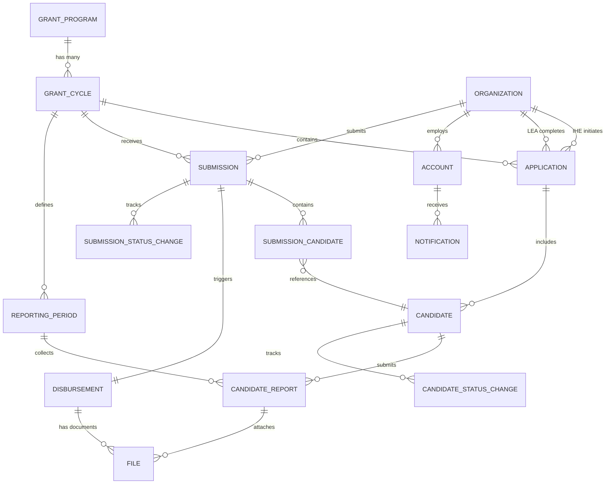
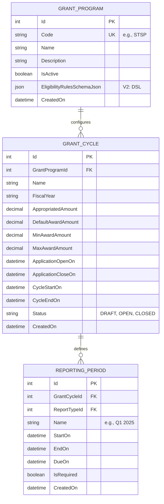
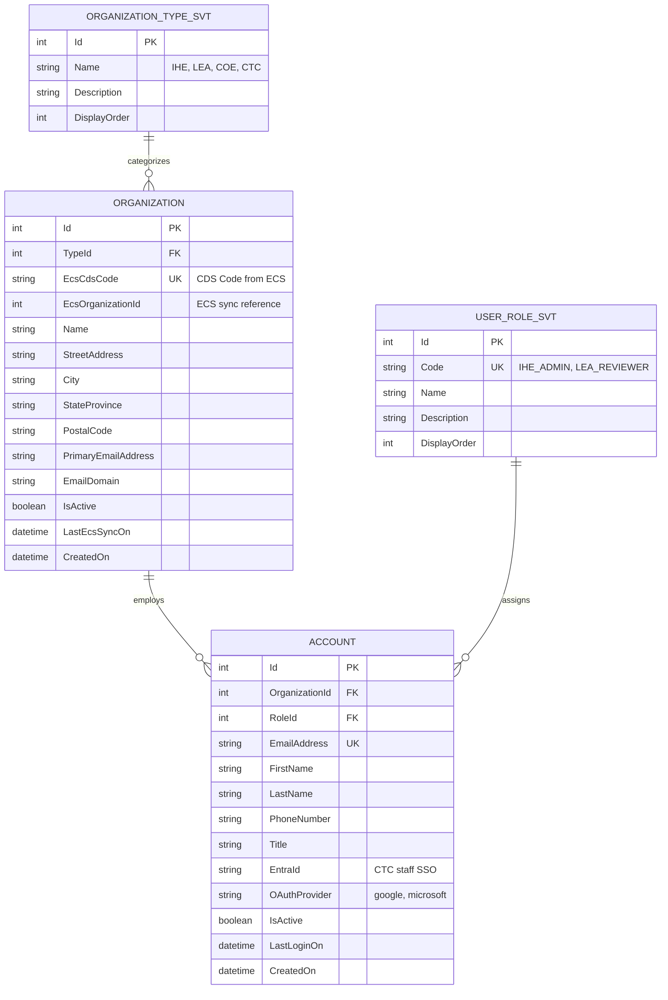
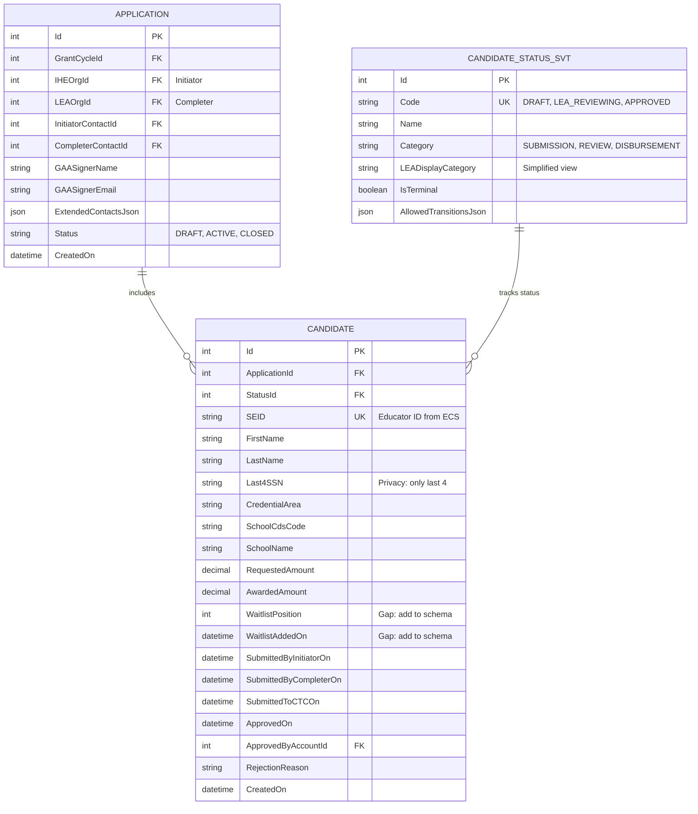
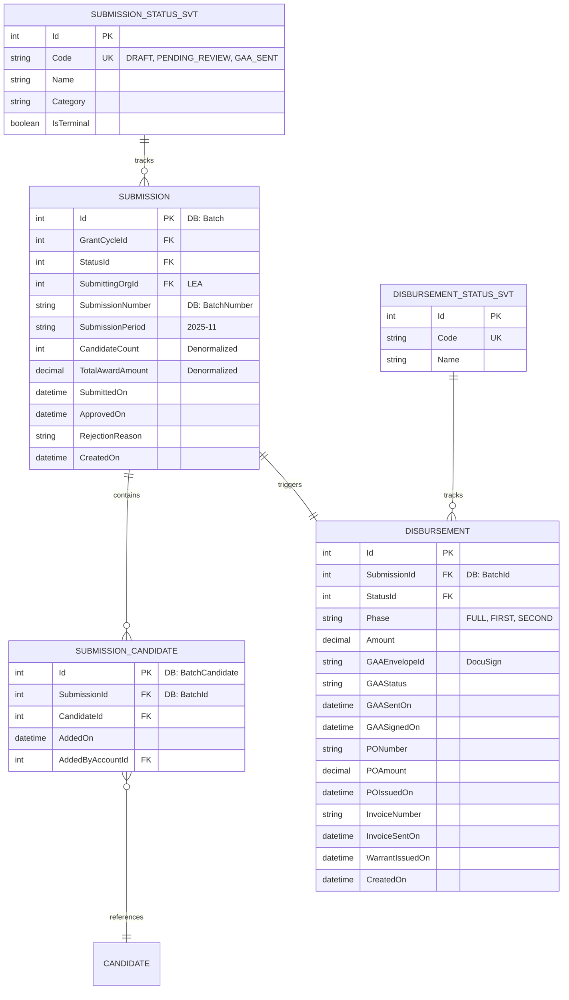
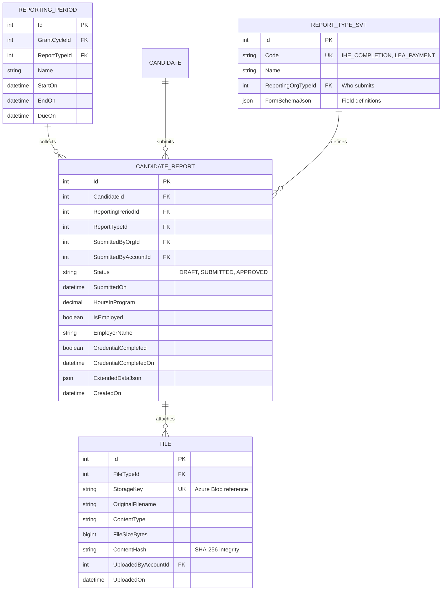
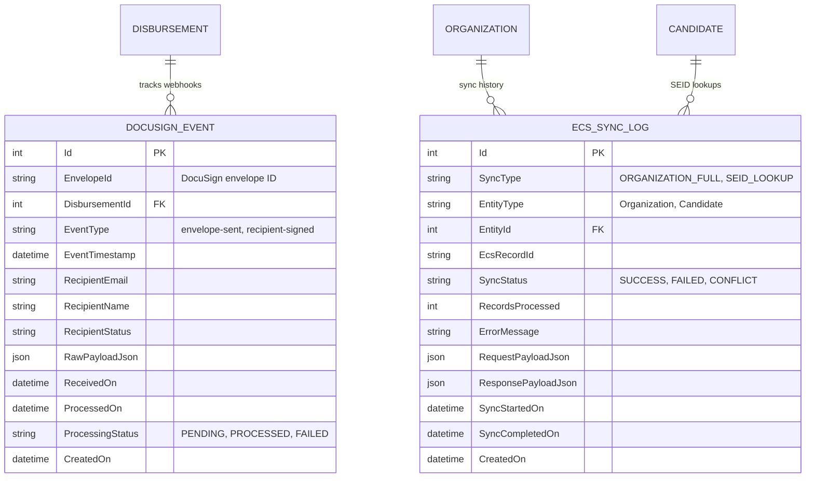

# GMS Entity Relationship Diagrams

Use a Mermaid renderer (VS Code extension, GitHub, or https://mermaid.live) to view these diagrams.

---

## 1. High-Level System ERD

---

## 2. Core Configuration Domain

---

## 3. Organization & User Domain

---

## 4. Application & Candidate Domain

---

## 5. Submission & Disbursement Domain

> **Note:** Database uses `Batch` but UI displays as "Submission"

---

## 6. Reporting Domain

---

## 7. Proposed Integration Tables (Gap Analysis)

---

## Quick View Instructions

1. **VS Code**: Install "Markdown Preview Mermaid Support" extension
2. **GitHub**: Paste into any `.md` file - renders automatically
3. **Online**: Copy diagram to https://mermaid.live
4. **Docusaurus/MkDocs**: Native Mermaid support

